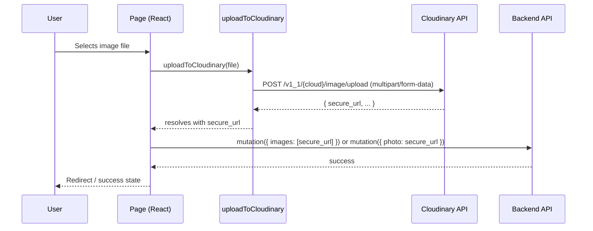

# Design Document: Cloudinary Image Upload

## Overview

This feature replaces the existing base64 compression approach with direct browser-to-Cloudinary uploads using unsigned upload presets. Instead of encoding images as base64 strings and embedding them in JSON payloads, the client uploads files directly to Cloudinary's API and receives back a secure HTTPS URL, which is then stored in the database.

The change affects three upload surfaces (edit profile, list product, request product), the shared `ImageUploader` component (new `isUploading` prop), and all `next/image` components that display remote images (blur placeholder).

No backend API routes, database models, or service layer code are modified.

---

## Architecture



The upload utility is a pure async function with no React dependencies, making it independently testable. Pages own the loading state and pass `isUploading` down to `ImageUploader`.

---

## Components and Interfaces

### `uploadToCloudinary` — `src/lib/upload/cloudinary.ts`

```typescript
export async function uploadToCloudinary(file: File): Promise<string>
```

Reads three `NEXT_PUBLIC_` env vars at call time. Builds a `FormData` payload with the file and upload preset, POSTs to the Cloudinary unsigned upload endpoint, and resolves with `secure_url`. Throws on missing config, API errors, or network failures.

### `ImageUploader` — `src/components/common/ImageUploader/ImageUploader.tsx`

New optional prop added to the existing interface:

```typescript
export interface ImageUploaderProps {
  // ... existing props unchanged ...
  isUploading?: boolean   // NEW: shows overlay spinner, disables file picker
}
```

When `isUploading` is `true`:
- A spinner overlay is rendered over the drop zone / avatar area
- The hidden `<input type="file">` is set to `disabled`
- The camera button / "Upload New" button is set to `disabled`

### `BLUR_DATA_URL` — `src/lib/upload/constants.ts`

```typescript
export const BLUR_DATA_URL =
  'data:image/jpeg;base64,/9j/4AAQSkZJRgABAQAAAQABAAD/2wBDAAgGBgcGBQgHBwcJCQgKDBQNDAsLDBkSEw8UHRofHh0aHBwgJC4nICIsIxwcKDcpLDAxNDQ0Hyc5PTgyPC4zNDL/wAARC...'
```

A 1×1 pixel JPEG encoded as base64. Exported from a shared constants file so all components import from one place rather than duplicating the string.

### Pages — upload integration

All three pages follow the same pattern:

1. Add `isUploading` state (`useState<boolean>(false)`)
2. In `handleSubmit`, set `isUploading = true` before calling `uploadToCloudinary`, set back to `false` in finally
3. Pass `isUploading` to `ImageUploader`
4. On upload error, show toast/notification and return early (do not call mutation)
5. Remove `compressImage` import

### `next/image` blur placeholder — affected components

| Component | Image usage | Change |
|---|---|---|
| `MyProfileView` | Profile avatar (`user.photo`) | Add `placeholder="blur" blurDataURL={BLUR_DATA_URL}` when src is non-empty |
| `MyProfileView` | Listings grid (`item.images[0]`) | Already has blur — ensure uses shared constant |
| `MyProfileView` | Requests grid (`item.images[0]`) | Already has blur — ensure uses shared constant |
| `ManageListingView` | Product hero image (`product.images[0]`) | Add blur props |
| `ManageRequestView` | Request hero image (`request.images[0]`) | Add blur props |

---

## Data Models

No new data models. The feature changes how image data reaches the backend, not what the backend stores.

**Before:** `images: string[]` contained base64 data URIs (`data:image/jpeg;base64,...`)  
**After:** `images: string[]` contains Cloudinary HTTPS URLs (`https://res.cloudinary.com/dp7zceqz7/image/upload/...`)

The field names and types in the API contracts remain identical.

### Environment Variables

| Variable | Scope | Value |
|---|---|---|
| `NEXT_PUBLIC_CLOUDINARY_CLOUD_NAME` | Client + Server | `dp7zceqz7` |
| `NEXT_PUBLIC_CLOUDINARY_API_KEY` | Client + Server | `781644622461612` |
| `NEXT_PUBLIC_CLOUDINARY_UPLOAD_PRESET` | Client + Server | `campus_uploads` |
| `CLOUDINARY_API_SECRET` | Server only | `<secret>` |

The API secret is never referenced in `src/lib/upload/cloudinary.ts` or any client-side module.

---

## Correctness Properties

*A property is a characteristic or behavior that should hold true across all valid executions of a system — essentially, a formal statement about what the system should do. Properties serve as the bridge between human-readable specifications and machine-verifiable correctness guarantees.*

### Property 1: Missing env var throws descriptive error

*For any* required `NEXT_PUBLIC_` Cloudinary environment variable that is absent at call time, calling `uploadToCloudinary` SHALL throw an error whose message explicitly names the missing variable.

**Validates: Requirements 1.5**

---

### Property 2: Upload utility resolves to the API's secure_url

*For any* `File` object and *for any* `secure_url` string returned by the Cloudinary API, `uploadToCloudinary(file)` SHALL resolve to that exact `secure_url` value — no transformation, truncation, or modification.

**Validates: Requirements 2.2, 2.4**

---

### Property 3: Upload utility sends a correctly structured POST request

*For any* `File` object passed to `uploadToCloudinary`, the outgoing HTTP request SHALL be a POST to `https://api.cloudinary.com/v1_1/{cloud_name}/image/upload`, with a `multipart/form-data` body containing the file under the `file` key and the upload preset under the `upload_preset` key.

**Validates: Requirements 2.3**

---

### Property 4: Upload utility rejects with API error message

*For any* error response body returned by the Cloudinary API (non-2xx status), `uploadToCloudinary` SHALL reject with an error whose message is derived from the response body rather than a generic fallback.

**Validates: Requirements 2.5**

---

### Property 5: Upload result URL is passed unchanged to the backend mutation

*For any* Cloudinary URL resolved by `uploadToCloudinary`, the page component SHALL pass that exact URL string to the backend mutation — as `photo` for profile updates, or as an element of the `images` array for product/request creation — without modification.

**Validates: Requirements 3.2, 4.2, 5.2**

---

### Property 6: Blur placeholder applied if and only if src is non-empty

*For any* `next/image` component in the affected views, `placeholder="blur"` and `blurDataURL={BLUR_DATA_URL}` SHALL be present when `src` is a non-null, non-empty string, and SHALL be absent when `src` is null or empty.

**Validates: Requirements 7.2, 7.4**

---

## Error Handling

| Scenario | Behavior |
|---|---|
| Missing `NEXT_PUBLIC_` env var | `uploadToCloudinary` throws synchronously with message: `"Missing Cloudinary env var: NEXT_PUBLIC_CLOUDINARY_CLOUD_NAME"` (or whichever is missing) |
| Cloudinary API returns non-2xx | Promise rejects with error message from response JSON (`error.message`) |
| Network failure (fetch throws) | Promise rejects with the original network error, re-thrown with context |
| Upload in progress, user tries to re-select | File input is disabled via `isUploading` prop — no duplicate upload possible |
| Upload fails on a page | `isUploading` is reset to `false` in `finally`, error toast is shown, mutation is not called |

---

## Testing Strategy

### Unit Tests

- `uploadToCloudinary` with mocked `fetch`:
  - Resolves to `secure_url` on success (Property 2)
  - Sends correct POST structure (Property 3)
  - Rejects with API error message on non-2xx (Property 4)
  - Throws on missing env vars (Property 1)
  - Rejects on network error (edge case from Req 2.6)
- `ImageUploader` with `isUploading=true`: spinner visible, input disabled
- `ImageUploader` with `isUploading=false`: normal interactive state

### Property-Based Tests

Using **fast-check** (already compatible with the TypeScript/Jest/Vitest stack). Minimum 100 iterations per property.

- **Property 1** — `fc.constantFrom(...requiredVars)` generates each missing var scenario; assert thrown error message contains the var name.
- **Property 2** — `fc.string()` generates arbitrary `secure_url` values; mock fetch to return them; assert resolved value equals input.
- **Property 3** — `fc.string()` generates file names/content; assert fetch was called with correct URL and FormData keys.
- **Property 4** — `fc.string()` generates arbitrary error message strings; mock fetch to return non-2xx with that message; assert rejection message contains it.
- **Property 5** — `fc.webUrl()` generates arbitrary Cloudinary URLs; mock `uploadToCloudinary`; assert mutation receives the exact URL.
- **Property 6** — `fc.oneof(fc.webUrl(), fc.constant(''), fc.constant(null))` generates src values; assert blur props presence matches src non-emptiness.

Tag format for each test: `// Feature: cloudinary-image-upload, Property N: <property_text>`

### Integration / Smoke Tests

- Verify `CLOUDINARY_API_SECRET` is not referenced in `src/lib/upload/cloudinary.ts` (static check)
- Verify `compressImage` is not imported in `EditProfilePage`, `ListProductPage`, `RequestProductPage` after migration
- Verify `BLUR_DATA_URL` constant is exported from `src/lib/upload/constants.ts`
- Manual end-to-end: upload a real image on each surface and confirm the stored URL is a valid `res.cloudinary.com` URL
