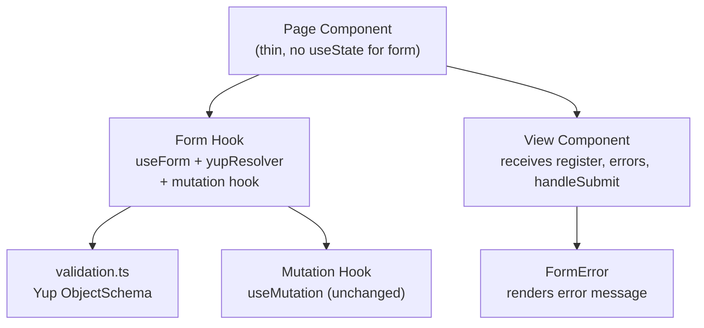

# Design Document: Frontend Form Validation

## Overview

This design covers the migration of all form-bearing modules from `useState`-based form state to React Hook Form (RHF) + Yup schema validation, along with TypeScript type fixes across both frontend modules and the entire `src/backend/` tree, and the creation of a Next.js architecture guide.

The migration is purely additive at the type and form-state layer — no runtime logic, API contracts, or data transformations change. The existing mutation hooks (`useLogin`, `useRegister`, etc.) remain untouched; new *form* hooks wrap them and own the RHF `useForm` call.

**Scope summary:**
- Install `react-hook-form`, `yup`, `@hookform/resolvers`
- Auth module: `validation.ts` + 5 form hooks + update 4 page components
- User module: `validation.ts` + 5 form hooks + update 5 page components
- Shared `FormError` component updated to accept `FieldErrors`-typed prop
- TypeScript type fixes: `useLogin`, `useUpdateProfile`, `ManageRequestView`, and all `src/backend/` files
- `docs/nextjs-architecture-guide.md`

---

## Architecture

The architecture follows the existing module pattern strictly. No new layers are introduced.

```
src/modules/{auth|user}/
  validation.ts          ← NEW: Yup schemas (pure functions, no side effects)
  hooks/
    use{Form}Form.ts     ← NEW: RHF useForm wrapper + exposes mutation result
    use{Mutation}.ts     ← EXISTING: unchanged mutation hooks
  components/
    {View}.tsx           ← MODIFIED: receives errors prop, renders FormError
  pages/
    {Page}.tsx           ← MODIFIED: uses form hook instead of useState
```



**Data flow for a form submission:**
1. User types → RHF tracks field state internally (no re-render per keystroke for uncontrolled inputs)
2. User submits → `handleSubmit(onValid)` runs Yup validation via resolver
3. If invalid → `formState.errors` populated → `FormError` renders beneath each failing field
4. If valid → `onValid` callback calls the existing mutation hook's `mutate()`
5. Mutation result (loading, error) flows back through the form hook to the page/view

---

## Components and Interfaces

### Yup Schemas (`validation.ts`)

Each module gets one file exporting all its schemas as named exports. Schemas are plain Yup `ObjectSchema` instances — no React, no side effects.

**Auth module** (`src/modules/auth/validation.ts`):
```ts
export const loginSchema: yup.ObjectSchema<LoginFormValues>
export const registerSchema: yup.ObjectSchema<RegisterFormValues>
export const forgotPasswordSchema: yup.ObjectSchema<ForgotPasswordFormValues>
export const resetPasswordSchema: yup.ObjectSchema<ResetPasswordFormValues>
export const updateProfileSchema: yup.ObjectSchema<UpdateProfileFormValues>
```

**User module** (`src/modules/user/validation.ts`):
```ts
export const editProfileSchema: yup.ObjectSchema<EditProfileForm>
export const listProductSchema: yup.ObjectSchema<ListProductForm>
export const requestProductSchema: yup.ObjectSchema<RequestProductForm>
export const manageListingSchema: yup.ObjectSchema<ManageListingForm>
export const manageRequestSchema: yup.ObjectSchema<ManageRequestForm>
```

The user module schemas reuse the existing interfaces from `src/modules/user/types.ts` as their inferred types.

### Form Hooks

Each form hook follows this interface pattern:

```ts
// Example: useLoginForm
export function useLoginForm() {
  const mutation = useLogin()
  const form = useForm<LoginFormValues>({
    resolver: yupResolver(loginSchema),
    defaultValues: { email: '', password: '' },
  })
  const onSubmit = form.handleSubmit((data) => mutation.mutate(data))
  return { ...form, onSubmit, mutation }
}
```

Hooks that need pre-populated defaults (edit profile, manage listing, manage request) accept the source data as a parameter and use `reset()` inside a `useEffect` when the data arrives:

```ts
export function useManageListingForm(product: ListedProduct | undefined) {
  const form = useForm<ManageListingForm>({ resolver: yupResolver(manageListingSchema) })
  useEffect(() => {
    if (product) form.reset({ /* map product fields */ })
  }, [product])
  return form
}
```

### FormError Component

The existing `FormError` component at `src/modules/auth/components/common/FormError.tsx` already accepts `message?: string` and renders nothing when undefined. It will be moved/re-exported to a shared location or duplicated in the user module. View components will be updated to accept an `errors` prop typed as `FieldErrors<T>` from `react-hook-form`.

```ts
// Updated view component prop signature example
interface ListProductViewProps {
  // ... existing props
  register: UseFormRegister<ListProductForm>
  errors: FieldErrors<ListProductForm>
  handleSubmit: UseFormHandleSubmit<ListProductForm>
  isSubmitting: boolean
}
```

### Page Component Pattern (after migration)

```tsx
// Before
export default function LoginPage() {
  const [email, setEmail] = useState('')
  const [password, setPassword] = useState('')
  const { mutate: login, isPending } = useLogin()
  // ...
}

// After
export default function LoginPage() {
  const { register, onSubmit, formState: { errors, isSubmitting } } = useLoginForm()
  return <LoginView register={register} errors={errors} onSubmit={onSubmit} isSubmitting={isSubmitting} />
}
```

---

## Data Models

### Form Value Types

These are the TypeScript types inferred from Yup schemas. For the user module, they align with the existing interfaces in `src/modules/user/types.ts`.

**Auth form value types** (new, defined alongside schemas in `validation.ts`):

```ts
export interface LoginFormValues {
  email: string
  password: string
}

export interface RegisterFormValues {
  name: string
  email: string
  password: string
  confirmPassword: string
}

export interface ForgotPasswordFormValues {
  email: string
}

export interface ResetPasswordFormValues {
  password: string
  confirmPassword: string
}

export interface UpdateProfileFormValues {
  name: string
  email: string
  phoneNumber: string
}
```

**User form value types** — reuse existing interfaces from `src/modules/user/types.ts`:
- `EditProfileForm`, `ListProductForm`, `RequestProductForm`, `ManageListingForm`, `ManageRequestForm`

### TypeScript Type Fix Inventory

**Frontend fixes:**

| File | Issue | Fix |
|------|-------|-----|
| `src/modules/auth/hooks/useLogin.ts` | `onSuccess` receives `{ user, accessToken, refreshToken }` but is cast to `AuthUser` | Destructure `data.user` and call `setAuth(data.user, '', '')` |
| `src/modules/auth/hooks/useUpdateProfile.ts` | `mutationFn` payload type is inline object literal | Change to `UpdateProfilePayload` from `src/modules/auth/types.ts` |
| `src/modules/user/components/ManageRequestView.tsx` | `form` prop typed as inline object literal | Change to `ManageRequestForm` from `src/modules/user/types.ts` |

**Backend fixes** (scan-and-fix across `src/backend/`):

The backend is already well-typed in most areas. The scan will focus on:
- `src/backend/services/*.ts` — verify all return types are explicit
- `src/backend/lib/env.ts` — verify env variable types
- `src/app/api/**/route.ts` — verify handler signatures use `NextRequest`
- Any `as unknown as X` double-cast patterns that can be narrowed
- Any implicit `any` from untyped catch blocks or JSON parsing

All fixes are type-layer only. If a runtime change would be required to satisfy the type system, a `// TODO: runtime fix needed` comment is added instead.

---

## Correctness Properties

*A property is a characteristic or behavior that should hold true across all valid executions of a system — essentially, a formal statement about what the system should do. Properties serve as the bridge between human-readable specifications and machine-verifiable correctness guarantees.*

The validation schemas in this feature are pure functions with clear input/output behavior — they accept a value and return valid/invalid. This makes them ideal candidates for property-based testing. The `FormError` component's render behavior is also a universal property.

**Property reflection:** After reviewing all testable criteria, the schema validation properties for auth and user modules share the same structural pattern (generate input → check schema.isValid()). Rather than listing one property per field rule, they are consolidated into per-schema properties that cover all field rules for that schema. The cross-field `priceTo > priceFrom` rule is kept separate as it tests a distinct relational invariant.

### Property 1: Login schema accepts valid credentials and rejects invalid ones

*For any* email string and password string, `loginSchema.isValid({ email, password })` SHALL return `true` if and only if `email` is a syntactically valid email address AND `password` has length ≥ 6.

**Validates: Requirements 2.2, 2.3**

### Property 2: Register schema enforces all field rules including password confirmation

*For any* `{ name, email, password, confirmPassword }` object, `registerSchema.isValid(input)` SHALL return `true` if and only if `name.length >= 2` AND `email` is a valid email AND `password.length >= 8` AND `confirmPassword === password`.

**Validates: Requirements 2.4, 2.5, 2.6, 2.7**

### Property 3: Forgot-password schema accepts valid emails only

*For any* string `email`, `forgotPasswordSchema.isValid({ email })` SHALL return `true` if and only if `email` is a syntactically valid, non-empty email address.

**Validates: Requirements 2.8**

### Property 4: Reset-password schema enforces length and confirmation match

*For any* `{ password, confirmPassword }` pair, `resetPasswordSchema.isValid(input)` SHALL return `true` if and only if `password.length >= 8` AND `confirmPassword === password`.

**Validates: Requirements 2.9, 2.10**

### Property 5: Update-profile schema enforces name, email, and phone rules

*For any* `{ name, email, phoneNumber }` object, `updateProfileSchema.isValid(input)` SHALL return `true` if and only if `name.length >= 2` AND `email` is a valid email AND `phoneNumber` matches a pattern of at least 7 digit characters.

**Validates: Requirements 2.11, 2.12, 2.13**

### Property 6: List-product schema enforces all product field rules

*For any* `ListProductForm`-shaped object, `listProductSchema.isValid(input)` SHALL return `true` if and only if `productName.length >= 3` AND `category` is a valid `ListedProductCategory` value AND `price` represents a positive number AND `description.length >= 10` AND `email` is a valid email AND `phoneNo` matches a phone pattern of at least 7 digits.

**Validates: Requirements 5.5, 5.6, 5.7, 5.8, 5.9, 5.10**

### Property 7: Request-product price range invariant

*For any* `RequestProductForm`-shaped object, `requestProductSchema.isValid(input)` SHALL return `false` whenever `priceTo <= priceFrom`, regardless of whether all other fields are valid.

**Validates: Requirements 5.13, 5.14**

### Property 8: FormError renders iff message is non-empty

*For any* string value passed as the `message` prop to `FormError`, the component SHALL render a non-empty DOM element if and only if the string is non-empty (i.e., `message.trim().length > 0`). When `message` is `undefined` or an empty string, the component SHALL render `null`.

**Validates: Requirements 10.3, 10.4**

---

## Error Handling

**Validation errors** are handled by RHF + Yup resolver. When `handleSubmit` is called:
- Yup runs synchronously against all fields
- Errors populate `formState.errors[fieldName].message`
- The form does NOT call the mutation if validation fails
- No toast is shown for validation errors — they display inline via `FormError`

**Mutation errors** (server-side, e.g. "Email already in use") continue to be handled by the existing `onError` callbacks in the mutation hooks, which call `toast.error()`. These are separate from Yup validation errors and are not wired into `formState.errors`.

**Type assertion errors** in the backend are handled conservatively: if a type assertion cannot be safely removed without a runtime change, a `// TODO: runtime fix needed` comment is added and the assertion is left in place (or widened to `as unknown as T` to silence the compiler without changing behavior).

**Missing required fields at runtime** (e.g. `user!._id` non-null assertions in page components) are left as-is per the no-functionality-changes constraint. The form hooks do not introduce new non-null assertions.

---

## Testing Strategy

### Unit Tests (example-based)

- Each form hook: render with `renderHook`, verify returned object has `register`, `handleSubmit`, `formState`, and the mutation result
- Each page component: render, submit empty form, verify `FormError` elements appear with correct messages
- `FormError` component: render with `message="some error"` → visible; render with `message={undefined}` → null

### Property-Based Tests

The project already has `fast-check` and `vitest` in `devDependencies`. Property tests use these directly.

**Library:** `fast-check` (already installed)
**Runner:** `vitest --run` (single execution, no watch mode)
**Minimum iterations:** 100 per property (fast-check default)
**Tag format:** `// Feature: frontend-form-validation, Property {N}: {property_text}`

Each correctness property maps to exactly one property-based test:

| Property | Test file | fast-check arbitraries |
|----------|-----------|------------------------|
| P1: loginSchema | `src/modules/auth/__tests__/validation.test.ts` | `fc.emailAddress()`, `fc.string()` |
| P2: registerSchema | same file | `fc.string()`, `fc.emailAddress()`, `fc.string({ minLength: 8 })` |
| P3: forgotPasswordSchema | same file | `fc.emailAddress()`, `fc.string()` |
| P4: resetPasswordSchema | same file | `fc.string({ minLength: 8 })`, `fc.string()` |
| P5: updateProfileSchema | same file | `fc.string()`, `fc.emailAddress()`, `fc.string()` |
| P6: listProductSchema | `src/modules/user/__tests__/validation.test.ts` | `fc.string()`, `fc.constantFrom(...LISTED_CATEGORIES)`, `fc.float({ min: 0.01 })` |
| P7: requestProductSchema price range | same file | `fc.integer({ min: 0 })`, `fc.integer({ min: 0 })` |
| P8: FormError render | `src/modules/auth/__tests__/FormError.test.tsx` | `fc.string({ minLength: 1 })`, `fc.constant(undefined)` |

### TypeScript Compilation Check

Run `npx tsc --noEmit` after all type fixes are applied. Zero errors is the acceptance criterion for Requirements 8 and 9.

### Integration / Smoke Tests

- Package installation: `npm install` completes without peer-dependency errors (Requirement 1.3)
- Manual smoke test: submit each form with empty fields → all `FormError` elements visible; fill valid data → form submits successfully
