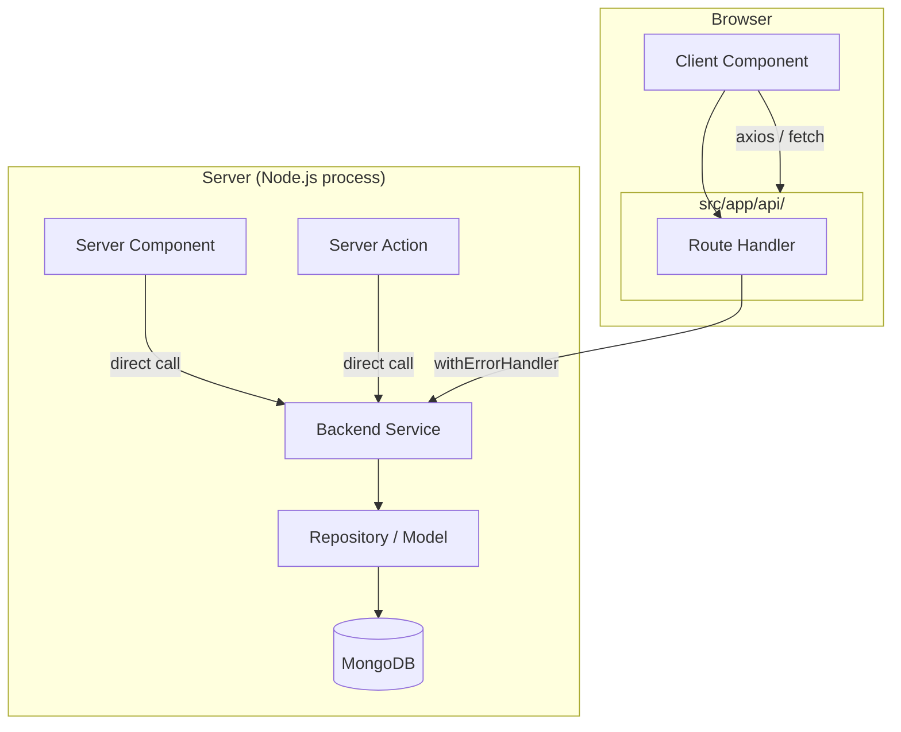

# Design Document: nextjs-fullstack-backend

## Overview

CollageCampus migrates from a separate Express/MongoDB server to a fullstack Next.js 16 (App Router) application. All backend logic lives in `src/backend/` and is exposed via Next.js Route Handlers under `src/app/api/`. The migration preserves every existing API contract while adopting Next.js idioms: httpOnly cookies for token storage, React `cache()` for server-side deduplication, server actions for form submissions, and server components as the default rendering strategy.

The existing frontend modules (`src/modules/`) and Zustand stores are preserved. The axios client is updated to use a relative base URL and `withCredentials: true` so httpOnly cookies are sent automatically. During the migration window, API routes also accept `Authorization: Bearer` headers for backward compatibility.

---

## Architecture

### High-Level Data Flow

Two distinct paths exist depending on whether the initiating component is a Server Component or a Client Component.



**Server Component path** — no HTTP round-trip. The component calls a query function (wrapped in `cache()`) which calls the service directly.

**Client Component path** — the component calls the axios client, which hits a Next.js Route Handler, which calls the service. The Route Handler is wrapped in `withErrorHandler` for uniform error formatting.

### Directory Structure

```
src/
├── backend/
│   ├── lib/
│   │   ├── db.ts              # Mongoose singleton
│   │   ├── jwt.ts             # generateAccessToken, generateRefreshToken, hashToken
│   │   ├── mailer.ts          # sendResetPasswordEmail
│   │   └── env.ts             # validated env object
│   ├── models/
│   │   ├── user.model.ts
│   │   ├── refreshToken.model.ts
│   │   ├── shop.model.ts
│   │   ├── job.model.ts
│   │   ├── listedProduct.model.ts
│   │   ├── requestedProduct.model.ts
│   │   └── cms.model.ts
│   ├── validators/
│   │   ├── auth.validator.ts
│   │   ├── shop.validator.ts
│   │   ├── job.validator.ts
│   │   ├── listedProduct.validator.ts
│   │   ├── requestedProduct.validator.ts
│   │   └── cms.validator.ts
│   ├── services/
│   │   ├── auth.service.ts
│   │   ├── shop.service.ts
│   │   ├── job.service.ts
│   │   ├── listedProduct.service.ts
│   │   ├── requestedProduct.service.ts
│   │   └── cms.service.ts
│   ├── queries/               # cache()-wrapped server-component fetchers
│   │   ├── shop.queries.ts
│   │   ├── job.queries.ts
│   │   ├── listedProduct.queries.ts
│   │   ├── requestedProduct.queries.ts
│   │   └── cms.queries.ts
│   ├── actions/               # "use server" server actions
│   │   ├── auth.actions.ts
│   │   ├── listedProduct.actions.ts
│   │   └── requestedProduct.actions.ts
│   └── types/
│       └── backend.types.ts   # shared TS interfaces
│
└── app/
    └── api/
        ├── auth/
        │   ├── register/route.ts
        │   ├── login/route.ts
        │   ├── logout/route.ts
        │   ├── refresh/route.ts
        │   ├── forgot-password/route.ts
        │   ├── reset-password/[token]/route.ts
        │   └── profile/route.ts
        ├── shops/
        │   ├── route.ts                        # GET list, POST create
        │   └── [id]/
        │       ├── route.ts                    # GET one, PUT update, DELETE
        │       └── offers/
        │           ├── route.ts                # POST add offer
        │           └── [offerId]/route.ts      # PUT update, DELETE
        ├── jobs/
        │   ├── route.ts
        │   └── [id]/route.ts
        ├── listed-products/
        │   ├── route.ts
        │   ├── my-products/route.ts
        │   └── [id]/route.ts
        ├── requested-products/
        │   ├── route.ts
        │   ├── my-requests/route.ts
        │   └── [id]/route.ts
        └── cms/
            ├── route.ts
            └── [type]/route.ts
```

---

## Components and Interfaces

### Auth Guard

The auth guard is the single source of truth for server-side session validation. It is wrapped in React `cache()` so that multiple server components in the same request share one DB lookup.

```ts
// src/backend/lib/authGuard.ts
import { cache } from 'react'
import { cookies } from 'next/headers'

export const getAuthUser = cache(async (): Promise<IUser | null> => {
  const cookieStore = await cookies()
  const accessToken = cookieStore.get('accessToken')?.value

  if (accessToken) {
    try {
      const decoded = jwt.verify(accessToken, env.JWT_ACCESS_SECRET) as { id: string }
      const user = await UserModel.findById(decoded.id).lean()
      return user ?? null
    } catch {
      // access token expired — attempt silent refresh below
    }
  }

  const refreshToken = cookieStore.get('refreshToken')?.value
  if (!refreshToken) return null

  try {
    const { accessToken: newAccess, refreshToken: newRefresh } = await refreshUserToken(refreshToken)
    // set new cookies — requires Next.js cookies() in a Server Action or Route Handler context
    // In a pure server component, we return the user but cannot set cookies;
    // cookie rotation happens in the /api/auth/refresh route handler instead.
    const decoded = jwt.verify(newAccess, env.JWT_ACCESS_SECRET) as { id: string }
    return await UserModel.findById(decoded.id).lean() ?? null
  } catch {
    return null
  }
})
```

**Design decision:** `getAuthUser` returns `null` rather than throwing. Callers (route handlers, server components) decide whether to redirect or return 401. This keeps the guard composable.

### Cookie Management

All cookie operations are centralised in a single helper to avoid scattered `Set-Cookie` logic.

```ts
// src/backend/lib/cookies.ts
import { cookies } from 'next/headers'

const IS_PROD = process.env.NODE_ENV === 'production'

export async function setAuthCookies(accessToken: string, refreshToken: string) {
  const store = await cookies()
  store.set('accessToken', accessToken, {
    httpOnly: true, secure: IS_PROD, sameSite: 'lax',
    path: '/', maxAge: 3540,
  })
  store.set('refreshToken', refreshToken, {
    httpOnly: true, secure: IS_PROD, sameSite: 'lax',
    path: '/', maxAge: 604800,
  })
}

export async function clearAuthCookies() {
  const store = await cookies()
  store.set('accessToken', '', { httpOnly: true, path: '/', maxAge: 0 })
  store.set('refreshToken', '', { httpOnly: true, path: '/', maxAge: 0 })
}
```

### withErrorHandler Wrapper

Every Route Handler is wrapped with `withErrorHandler` to guarantee the standard error envelope.

```ts
// src/backend/lib/withErrorHandler.ts
import { NextRequest, NextResponse } from 'next/server'
import { AppError } from './appError'

type Handler = (req: NextRequest, ctx: { params: Record<string, string> }) => Promise<NextResponse>

export function withErrorHandler(handler: Handler): Handler {
  return async (req, ctx) => {
    try {
      return await handler(req, ctx)
    } catch (err) {
      if (err instanceof AppError) {
        return NextResponse.json(
          { code: err.statusCode, success: false, message: err.message,
            errorCode: err.errorCode, data: null, details: err.details ?? null },
          { status: err.statusCode }
        )
      }
      const message = process.env.NODE_ENV === 'production'
        ? 'Internal Server Error'
        : (err instanceof Error ? err.message : String(err))
      return NextResponse.json(
        { code: 500, success: false, message, errorCode: 'INTERNAL_SERVER_ERROR', data: null },
        { status: 500 }
      )
    }
  }
}
```

### AppError Class

```ts
// src/backend/lib/appError.ts
export class AppError extends Error {
  statusCode: number
  errorCode: string
  isOperational = true
  details?: unknown[]

  constructor(message: string, statusCode: number, errorCode = 'ERROR', details?: unknown[]) {
    super(message)
    this.statusCode = statusCode
    this.errorCode = errorCode
    this.details = details
    Error.captureStackTrace(this, this.constructor)
  }
}
```

### Validate Helper

```ts
// src/backend/lib/validate.ts
import { ZodSchema, ZodError } from 'zod'
import { AppError } from './appError'

export function validate<T>(schema: ZodSchema<T>, data: unknown): T {
  try {
    return schema.parse(data)
  } catch (err) {
    if (err instanceof ZodError) {
      const details = err.issues.map(i => `${i.path.join('.')}: ${i.message}`)
      throw new AppError(details.join(', '), 400, 'VALIDATION_ERROR', details)
    }
    throw err
  }
}
```

### Authorize Helper

```ts
// src/backend/lib/authorize.ts
import { AppError } from './appError'
import { UserRole } from '../models/user.model'

export function authorize(user: IUser | null, ...roles: UserRole[]): IUser {
  if (!user) throw new AppError('Unauthorized', 401, 'UNAUTHORIZED')
  if (!roles.includes(user.role)) throw new AppError('Forbidden', 403, 'FORBIDDEN')
  return user
}
```

### Route Handler Pattern

```ts
// Example: src/app/api/shops/route.ts
export const GET = withErrorHandler(async (req) => {
  const user = await getAuthUser()
  if (!user) throw new AppError('Unauthorized', 401, 'UNAUTHORIZED')

  const { searchParams } = new URL(req.url)
  const filters = validate(listShopsQuerySchema, Object.fromEntries(searchParams))
  const result = await getShops(filters)
  return sendSuccess(result)
})

export const POST = withErrorHandler(async (req) => {
  const user = await getAuthUser()
  authorize(user, UserRole.ADMIN)

  const body = await req.json()
  const data = validate(createShopSchema, body)
  const shop = await createShop(data, user._id.toString())
  return sendSuccess(shop, 201)
})
```

### Server Actions Architecture

Server actions live in `src/backend/actions/` and are marked `"use server"`. They call services directly and manage cookies via the `cookies()` API.

```ts
// src/backend/actions/auth.actions.ts
'use server'
import { loginUser } from '../services/auth.service'
import { setAuthCookies, clearAuthCookies } from '../lib/cookies'
import { validate } from '../lib/validate'
import { loginSchema } from '../validators/auth.validator'

export async function loginAction(formData: FormData) {
  try {
    const data = validate(loginSchema, {
      email: formData.get('email'),
      password: formData.get('password'),
    })
    const deviceInfo = { name: 'server-action' }
    const { accessToken, refreshToken, user } = await loginUser(data.email, data.password, deviceInfo)
    await setAuthCookies(accessToken, refreshToken)
    return { success: true, user }
  } catch (err) {
    return { success: false, error: err instanceof Error ? err.message : 'Login failed' }
  }
}

export async function logoutAction() {
  const store = await cookies()
  const refreshToken = store.get('refreshToken')?.value
  if (refreshToken) await logoutUser(refreshToken)
  await clearAuthCookies()
}
```

### Axios Client Migration

```ts
// src/lib/axiosClient.ts  (updated)
import axios from 'axios'

const axiosClient = axios.create({
  baseURL: '/',          // relative — hits Next.js Route Handlers
  withCredentials: true, // sends httpOnly cookies automatically
})

// Remove Authorization header injection — cookies handle auth now
axiosClient.interceptors.request.use((config) => config)

// Refresh interceptor — no body needed, cookie is read server-side
axiosClient.interceptors.response.use(
  (res) => res,
  async (error) => {
    const original = error.config
    if (error.response?.status === 401 && !original._retry) {
      original._retry = true
      try {
        await axiosClient.post('/api/auth/refresh')
        return axiosClient(original)
      } catch {
        useAuthStore.getState().clearAuth()
        window.location.href = '/login'
      }
    }
    return Promise.reject(error)
  }
)
```

### Query Functions (Server Components)

```ts
// src/backend/queries/shop.queries.ts
import { cache } from 'react'
import { getShops as getShopsService, getShopById as getShopByIdService } from '../services/shop.service'

export const getShops = cache(async (filters: ListShopsQuery) => {
  await connectDB()
  return getShopsService(filters)
})

export const getShopById = cache(async (id: string) => {
  await connectDB()
  return getShopByIdService(id)
})
```

---

## Data Models

### TypeScript Interfaces

```ts
// src/backend/types/backend.types.ts

export enum UserRole { ADMIN = 'ADMIN', USER = 'USER' }
export enum JobType { PART_TIME = 'part-time', FULL_TIME = 'full-time' }
export enum ProductCategory {
  ELECTRONICS = 'ELECTRONICS', CLOTHING_FASHION = 'CLOTHING_FASHION',
  HOME_KITCHEN = 'HOME_KITCHEN', BEAUTY_PERSONAL_CARE = 'BEAUTY_PERSONAL_CARE',
  SPORTS_FITNESS = 'SPORTS_FITNESS', BOOKS_STATIONERY = 'BOOKS_STATIONERY',
  TOYS_GAMES = 'TOYS_GAMES', AUTOMOTIVE = 'AUTOMOTIVE',
  GROCERIES_FOOD = 'GROCERIES_FOOD', HEALTH_WELLNESS = 'HEALTH_WELLNESS',
}
export enum ProductCondition { NEW = 'NEW', USED = 'USED', REFURBISHED = 'REFURBISHED' }
export enum CmsType {
  TERMS_AND_CONDITIONS = 'TERMS_AND_CONDITIONS', PRIVACY_POLICY = 'PRIVACY_POLICY',
  ABOUT_US = 'ABOUT_US', FAQ = 'FAQ',
}

export interface IUser {
  _id: string; name: string; email: string; password: string
  role: UserRole; phoneNumber?: string; photo?: string
  resetPasswordToken?: string; resetPasswordExpire?: Date
  createdAt: Date; updatedAt: Date
}

export interface IRefreshToken {
  _id: string; userId: string; token: string; expiresAt: Date
  deviceInfo?: { ip?: string; name?: string }; createdAt: Date
}

export interface IDayTiming { isOpen: boolean; opensAt: string | null; closesAt: string | null }
export interface IShopTiming {
  monday: IDayTiming; tuesday: IDayTiming; wednesday: IDayTiming
  thursday: IDayTiming; friday: IDayTiming; saturday: IDayTiming; sunday: IDayTiming
}
export interface IOffer {
  offerId: string; shopId: string; offerName: string
  startDate: Date; endDate: Date; description: string; photo: string
}
export interface IShop {
  _id: string; name: string; createdBy: string; shopId: string; type: string
  location: string; distance?: string; photo?: string; photos?: string[]
  poster?: string; topItems?: string[]; allItems?: string[]
  contactDetails: { email: string; phoneNo: string }
  shopTiming: IShopTiming; offers?: IOffer[]; createdAt: Date; updatedAt: Date
}

export interface IJob {
  _id: string; jobName: string; jobId: string; createdBy: string
  jobProvider: string; type: JobType; deadline: Date; location: string
  experience: number; salary: { from: number; to: number }
  jobDescription: string; responsibilities: string[]
  contactDetails: { email: string; phoneNo: string }; createdAt: Date; updatedAt: Date
}

export interface IListedProduct {
  _id: string; user: string; productName: string; images: string[]
  category: ProductCategory; condition: ProductCondition; price: string
  isNegotiable: boolean; description: string; yearUsed: number
  contactDetails: { phoneNo: string; email: string }
  isAvailable: boolean; createdAt: Date; updatedAt: Date
}

export interface IRequestedProduct {
  _id: string; user: string; name: string; images?: string[]
  category: ProductCategory; price: { from: number; to: number }
  isNegotiable: boolean; description: string
  contactDetails: { phoneNo: string; email: string }
  isFulfilled: boolean; createdAt: Date; updatedAt: Date
}

export interface ICms {
  _id: string; cmsId: string; type: string; title: string
  content: string; isActive: boolean; createdAt: Date; updatedAt: Date
}

export interface ApiResponse<T = unknown> {
  code: number; success: boolean; message: string; data: T | null
}
export interface PaginatedResponse<T> extends ApiResponse<T[]> {
  total: number; page: number; limit: number
}
export interface ErrorResponse {
  code: number; success: false; message: string
  errorCode: string; data: null; details?: unknown[]
}
```

### Mongoose Model Patterns

Each model file follows this pattern (shown for User):

```ts
// src/backend/models/user.model.ts
import mongoose, { Schema, Document } from 'mongoose'
import { UserRole } from '../types/backend.types'

export interface IUserDocument extends IUser, Document {}

const UserSchema = new Schema<IUserDocument>({
  name:                 { type: String, required: true },
  email:                { type: String, required: true, unique: true },
  password:             { type: String, required: true },
  role:                 { type: String, enum: Object.values(UserRole), default: UserRole.USER },
  phoneNumber:          { type: String },
  photo:                { type: String },
  resetPasswordToken:   { type: String },
  resetPasswordExpire:  { type: Date },
}, { timestamps: true })

export const UserModel = mongoose.models.User ?? mongoose.model<IUserDocument>('User', UserSchema)
```

The `mongoose.models.User ?? mongoose.model(...)` pattern prevents "Cannot overwrite model once compiled" errors during Next.js hot reloads.

---

## Zod Validators

### auth.validator.ts

```ts
export const registerSchema = z.object({
  name: z.string().min(3),
  email: z.string().email(),
  password: z.string().min(6),
})

export const loginSchema = z.object({
  email: z.string().email(),
  password: z.string().min(1),
})

export const forgotPasswordSchema = z.object({ email: z.string().email() })

export const resetPasswordSchema = z.object({ password: z.string().min(6) })

export const updateProfileSchema = z.object({
  name: z.string().min(3).optional(),
  email: z.string().email().optional(),
  phoneNumber: z.string().min(10).optional(),
  photo: z.union([z.string().url(), z.literal('')]).optional(),
})
```

### shop.validator.ts

```ts
const dayTimingSchema = z.object({
  isOpen: z.boolean(),
  opensAt: z.string().nullable(),
  closesAt: z.string().nullable(),
})

const shopTimingSchema = z.object({
  monday: dayTimingSchema, tuesday: dayTimingSchema, wednesday: dayTimingSchema,
  thursday: dayTimingSchema, friday: dayTimingSchema,
  saturday: dayTimingSchema, sunday: dayTimingSchema,
})

export const createOfferSchema = z.object({
  offerId: z.string().optional(), shopId: z.string().optional(),
  offerName: z.string().min(1),
  startDate: z.string().transform(s => new Date(s)),
  endDate: z.string().transform(s => new Date(s)),
  description: z.string().min(1), photo: z.string(),
})
export const updateOfferSchema = createOfferSchema.partial()

export const createShopSchema = z.object({
  name: z.string().min(1), shopId: z.string().optional(),
  type: z.string().min(1), location: z.string().min(1),
  distance: z.string().optional(), photo: z.string().optional(),
  photos: z.array(z.string()).optional(), poster: z.string().optional(),
  topItems: z.array(z.string()).optional(), allItems: z.array(z.string()).optional(),
  contactDetails: z.object({ email: z.string().email(), phoneNo: z.string() }),
  shopTiming: shopTimingSchema,
  offers: z.array(createOfferSchema).optional(),
})
export const updateShopSchema = createShopSchema.partial()

export const listShopsQuerySchema = z.object({
  page: z.coerce.number().int().positive().optional(),
  limit: z.coerce.number().int().positive().optional(),
  search: z.string().optional(),
  distance: z.string().optional(),
  openDay: z.enum(['monday','tuesday','wednesday','thursday','friday','saturday','sunday']).optional(),
})
```

### job.validator.ts

```ts
export const createJobSchema = z.object({
  jobName: z.string().min(1), jobProvider: z.string().min(1),
  type: z.nativeEnum(JobType),
  deadline: z.string().transform(s => new Date(s)),
  location: z.string().min(1), experience: z.number().min(0),
  salary: z.object({ from: z.number().min(0), to: z.number().min(0) }),
  jobDescription: z.string().min(1),
  responsibilities: z.array(z.string()).min(1),
  contactDetails: z.object({ email: z.string().email(), phoneNo: z.string() }),
})
export const updateJobSchema = createJobSchema.partial()

export const listJobsQuerySchema = z.object({
  page: z.coerce.number().optional(), limit: z.coerce.number().optional(),
  search: z.string().optional(), jobType: z.nativeEnum(JobType).optional(),
  minExperience: z.coerce.number().optional(), maxExperience: z.coerce.number().optional(),
  minSalary: z.coerce.number().optional(), maxSalary: z.coerce.number().optional(),
  deadlineFrom: z.string().optional(), deadlineTo: z.string().optional(),
})
```

### listedProduct.validator.ts

```ts
export const createListedProductSchema = z.object({
  productName: z.string().min(1),
  images: z.array(z.string().url()).min(1),
  category: z.nativeEnum(ProductCategory),
  condition: z.nativeEnum(ProductCondition),
  price: z.string().min(1), isNegotiable: z.boolean(),
  description: z.string().min(1), yearUsed: z.number().min(0),
  contactDetails: z.object({ phoneNo: z.string().min(1), email: z.string().email() }),
  isAvailable: z.boolean().optional(),
})
export const updateListedProductSchema = createListedProductSchema.partial()

export const listProductsQuerySchema = z.object({
  page: z.coerce.number().optional(), limit: z.coerce.number().optional(),
  search: z.string().optional(),
  category: z.nativeEnum(ProductCategory).optional(),
  condition: z.nativeEnum(ProductCondition).optional(),
  minPrice: z.coerce.number().optional(), maxPrice: z.coerce.number().optional(),
  minYearUsed: z.coerce.number().optional(), maxYearUsed: z.coerce.number().optional(),
})
```

### requestedProduct.validator.ts

```ts
export const createRequestedProductSchema = z.object({
  name: z.string().min(1), images: z.array(z.string().url()).optional(),
  category: z.nativeEnum(ProductCategory),
  price: z.object({ from: z.number().min(0), to: z.number().min(0) }),
  isNegotiable: z.boolean(), description: z.string().min(1),
  contactDetails: z.object({ phoneNo: z.string().min(1), email: z.string().email() }),
  isFulfilled: z.boolean().optional(),
})
export const updateRequestedProductSchema = createRequestedProductSchema.partial()

export const listRequestedProductsQuerySchema = z.object({
  page: z.coerce.number().optional(), limit: z.coerce.number().optional(),
  search: z.string().optional(),
  category: z.nativeEnum(ProductCategory).optional(),
  isNegotiable: z.string().transform(v => v === 'true').optional(),
  isFulfilled: z.string().transform(v => v === 'true').optional(),
  minPrice: z.coerce.number().optional(), maxPrice: z.coerce.number().optional(),
})
```

### cms.validator.ts

```ts
export const createCmsSchema = z.object({
  type: z.string().min(1), title: z.string().min(1),
  content: z.string().min(1), isActive: z.boolean().optional(),
})
export const updateCmsSchema = createCmsSchema.partial()
```

---

## Service Layer Function Signatures

### auth.service.ts

```ts
registerUser(data: { name: string; email: string; password: string }): Promise<IUser>
loginUser(email: string, password: string, deviceInfo?: { ip?: string; name?: string }):
  Promise<{ accessToken: string; refreshToken: string; user: Omit<IUser, 'password'> }>
refreshUserToken(token: string, deviceInfo?: { ip?: string; name?: string }):
  Promise<{ accessToken: string; refreshToken: string }>
logoutUser(token: string): Promise<void>
forgotPassword(email: string): Promise<string>   // returns plain reset token
resetPassword(token: string, newPassword: string): Promise<void>
updateProfile(userId: string, data: Partial<Pick<IUser, 'name'|'email'|'phoneNumber'|'photo'>>):
  Promise<Omit<IUser, 'password'>>
```

### shop.service.ts

```ts
createShop(data: CreateShopInput, userId: string): Promise<IShop>
updateShop(id: string, data: Partial<CreateShopInput>): Promise<IShop>
deleteShop(id: string): Promise<void>
getShops(filters: ListShopsQuery): Promise<{ shops: IShop[]; total: number; page: number; limit: number }>
getShopById(id: string): Promise<IShop>
addOffer(shopId: string, offerData: CreateOfferInput): Promise<IShop>
updateOffer(shopId: string, offerId: string, offerData: Partial<CreateOfferInput>): Promise<IShop>
deleteOffer(shopId: string, offerId: string): Promise<IShop>
```

### job.service.ts

```ts
createJob(data: CreateJobInput, userId: string): Promise<IJob>
updateJob(id: string, data: Partial<CreateJobInput>): Promise<IJob>
deleteJob(id: string): Promise<void>
getJobs(filters: ListJobsQuery): Promise<{ jobs: IJob[]; total: number; page: number; limit: number }>
getJobById(id: string): Promise<IJob>
```

### listedProduct.service.ts

```ts
createListedProduct(data: CreateListedProductInput, userId: string): Promise<IListedProduct>
getListedProducts(filters: ListProductsQuery):
  Promise<{ products: IListedProduct[]; total: number; page: number; limit: number }>
getListedProductById(id: string): Promise<IListedProduct>
updateListedProduct(id: string, userId: string, data: Partial<CreateListedProductInput>): Promise<IListedProduct>
deleteListedProduct(id: string, userId: string): Promise<void>
```

### requestedProduct.service.ts

```ts
createRequestedProduct(data: CreateRequestedProductInput, userId: string): Promise<IRequestedProduct>
getRequestedProducts(filters: ListRequestedProductsQuery):
  Promise<{ requests: IRequestedProduct[]; total: number; page: number; limit: number }>
getRequestedProductById(id: string): Promise<IRequestedProduct>
updateRequestedProduct(id: string, userId: string, data: Partial<CreateRequestedProductInput>): Promise<IRequestedProduct>
deleteRequestedProduct(id: string, userId: string): Promise<void>
```

### cms.service.ts

```ts
createCms(data: CreateCmsInput): Promise<ICms>
updateCms(type: string, data: Partial<CreateCmsInput>): Promise<ICms>
deleteCms(type: string): Promise<void>
getCmsByType(type: string): Promise<ICms>
getAllCmsPages(): Promise<ICms[]>
```

---

## Correctness Properties

*A property is a characteristic or behavior that should hold true across all valid executions of a system — essentially, a formal statement about what the system should do. Properties serve as the bridge between human-readable specifications and machine-verifiable correctness guarantees.*


### Property Reflection

Before writing properties, reviewing for redundancy:

- Properties for `generateAccessToken` and `generateRefreshToken` are structurally identical (JWT round-trip). They can be combined into one property covering both token generators.
- Properties for `validate()` correctness and `withErrorHandler` correctness are distinct — one tests the validation layer, the other tests the error wrapping layer. Keep separate.
- The `sendSuccess` envelope property and the `withErrorHandler` error envelope property are complementary, not redundant. Keep both.
- The password hashing property (bcrypt round-trip) and the login token storage property (hash round-trip) are distinct. Keep both.
- The `hashToken` determinism property and the token storage property both involve hashing but test different things. Keep both.
- The `validate()` property and the `registerSchema` validation property overlap — `validate()` is the general case, `registerSchema` is a specific instance. Consolidate: one property for the `validate()` helper covers all schemas.

After reflection: 7 distinct properties remain.

---

### Property 1: JWT Token Round-Trip

*For any* userId string, both `generateAccessToken(userId)` and `generateRefreshToken(userId)` SHALL produce a JWT that, when verified with the corresponding secret, decodes to an object containing `{ id: userId }`.

**Validates: Requirements 3.1, 3.2**

---

### Property 2: Token Hash Determinism

*For any* token string, `hashToken(token)` SHALL always return the same hex digest (determinism), and for any two distinct token strings `t1 !== t2`, `hashToken(t1) !== hashToken(t2)` (collision resistance within the test input space).

**Validates: Requirements 3.3**

---

### Property 3: Password Hashing Round-Trip

*For any* plaintext password string, after `registerUser()` stores the user, the persisted `password` field SHALL NOT equal the plaintext, and `bcrypt.compare(plaintext, storedHash)` SHALL return `true`.

**Validates: Requirements 4.3**

---

### Property 4: Login Stores Hashed Refresh Token

*For any* registered user credentials, `loginUser(email, password)` SHALL return a `refreshToken`, and the `RefreshToken` collection SHALL contain a document where `token === hashToken(returnedRefreshToken)` — the plain token is never persisted.

**Validates: Requirements 5.3**

---

### Property 5: Validate Helper Correctness

*For any* Zod schema and valid input data, `validate(schema, data)` SHALL return the same parsed result as `schema.parse(data)`. *For any* invalid input, `validate(schema, data)` SHALL throw an `AppError` with `statusCode 400` and `errorCode "VALIDATION_ERROR"`, with `details` containing at least one formatted issue string.

**Validates: Requirements 13.1, 13.2, 13.3**

---

### Property 6: withErrorHandler Error Envelope

*For any* Route Handler that throws an `AppError(message, statusCode, errorCode)`, `withErrorHandler` SHALL catch it and return a `NextResponse` with HTTP status equal to `AppError.statusCode` and a JSON body matching `{ success: false, errorCode: AppError.errorCode, data: null }`. *For any* handler that throws a non-AppError, the response SHALL have HTTP status `500`.

**Validates: Requirements 19.2, 19.3, 25.2, 25.3, 25.4**

---

### Property 7: Server Action Never Throws on Validation Failure

*For any* `FormData` input that fails schema validation, the server actions `loginAction`, `registerAction`, `updateProfileAction`, `createListedProductAction`, and `createRequestedProductAction` SHALL return `{ success: false, error: string }` without throwing an exception to the caller.

**Validates: Requirements 21.7**

---

## Error Handling

### Error Flow

```
Route Handler
  └─ withErrorHandler(handler)
       ├─ handler throws AppError
       │    └─ caught → { code, success: false, message, errorCode, data: null, details? }
       └─ handler throws Error / unknown
            └─ caught → { code: 500, success: false, message: "Internal Server Error" (prod) }
```

### AppError Error Codes

| errorCode | statusCode | Trigger |
|-----------|-----------|---------|
| `VALIDATION_ERROR` | 400 | Zod parse failure |
| `INVALID_OR_EXPIRED_TOKEN` | 400 | Reset token expired or not found |
| `UNAUTHORIZED` | 401 | Missing or invalid access token |
| `INVALID_CREDENTIALS` | 401 | Wrong email or password |
| `INVALID_TOKEN` | 401 | Invalid refresh token JWT |
| `TOKEN_REUSE` | 401 | Refresh token reuse detected |
| `FORBIDDEN` | 403 | Insufficient role |
| `NOT_FOUND` | 404 | Resource not found |
| `EMAIL_ALREADY_EXISTS` | 409 | Duplicate email on register/update |
| `CMS_TYPE_EXISTS` | 409 | Duplicate CMS type |
| `INTERNAL_SERVER_ERROR` | 500 | Unexpected error |

### Mongoose Connection Errors

`connectDB()` propagates Mongoose connection errors to the caller. Route Handlers catch these via `withErrorHandler` and return 500. The singleton pattern ensures a failed connection is retried on the next request rather than crashing the process.

---

## Testing Strategy

### Dual Testing Approach

Unit tests cover specific examples, edge cases, and error conditions. Property-based tests verify universal properties across generated inputs. Both are needed for comprehensive coverage.

### Property-Based Testing Library

Use **fast-check** (TypeScript-native, works in Node.js without a test runner dependency):

```bash
npm install --save-dev fast-check vitest
```

Each property test runs a minimum of **100 iterations**. Tag format:

```ts
// Feature: nextjs-fullstack-backend, Property N: <property_text>
```

### Property Test Sketches

```ts
// Property 1: JWT Token Round-Trip
// Feature: nextjs-fullstack-backend, Property 1: JWT token round-trip
fc.assert(fc.property(fc.string({ minLength: 1 }), (userId) => {
  const token = generateAccessToken(userId)
  const decoded = jwt.verify(token, env.JWT_ACCESS_SECRET) as { id: string }
  return decoded.id === userId
}))

// Property 5: Validate Helper Correctness
// Feature: nextjs-fullstack-backend, Property 5: validate helper correctness
fc.assert(fc.property(fc.record({ name: fc.string({ minLength: 3 }), email: fc.emailAddress(), password: fc.string({ minLength: 6 }) }), (input) => {
  const result = validate(registerSchema, input)
  return result.email === input.email && result.name === input.name
}))

// Property 6: withErrorHandler Error Envelope
// Feature: nextjs-fullstack-backend, Property 6: withErrorHandler error envelope
fc.assert(fc.property(
  fc.integer({ min: 400, max: 599 }),
  fc.string({ minLength: 1 }),
  fc.string({ minLength: 1 }),
  async (statusCode, message, errorCode) => {
    const handler = async () => { throw new AppError(message, statusCode, errorCode) }
    const wrapped = withErrorHandler(handler)
    const res = await wrapped(mockReq, mockCtx)
    const body = await res.json()
    return res.status === statusCode && body.errorCode === errorCode && body.success === false
  }
))
```

### Unit Test Coverage

- `connectDB()`: missing MONGODB_URI throws, duplicate calls reuse connection
- `loginUser()`: wrong email → 401, wrong password → 401
- `refreshUserToken()`: reuse detection deletes all tokens and throws TOKEN_REUSE
- `forgotPassword()`: unknown email → 404
- `resetPassword()`: expired token → 400
- Cookie attributes: after login response, `Set-Cookie` headers contain `HttpOnly`, `SameSite=Lax`, `Secure` (prod only)
- Axios client: `withCredentials: true` is set, base URL is `/`, no Authorization header injection

### Integration Test Coverage

- Full auth flow: register → login → access protected route → refresh → logout
- Ownership enforcement: USER cannot update/delete another user's listed product
- ADMIN-only routes: USER receives 403 on shop/job/CMS write endpoints
- CMS public routes: unauthenticated requests to `GET /api/cms` return 200
